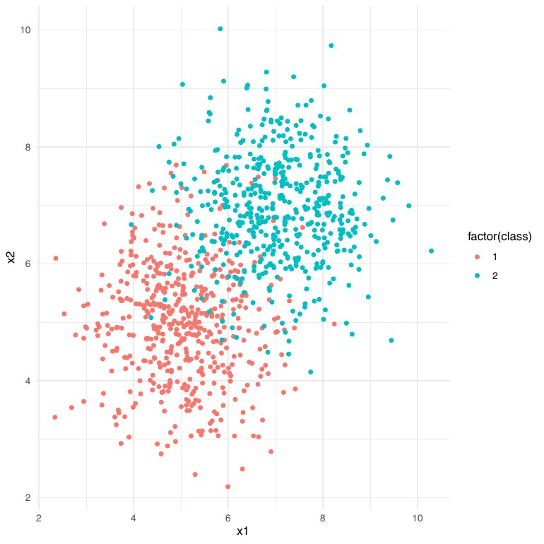
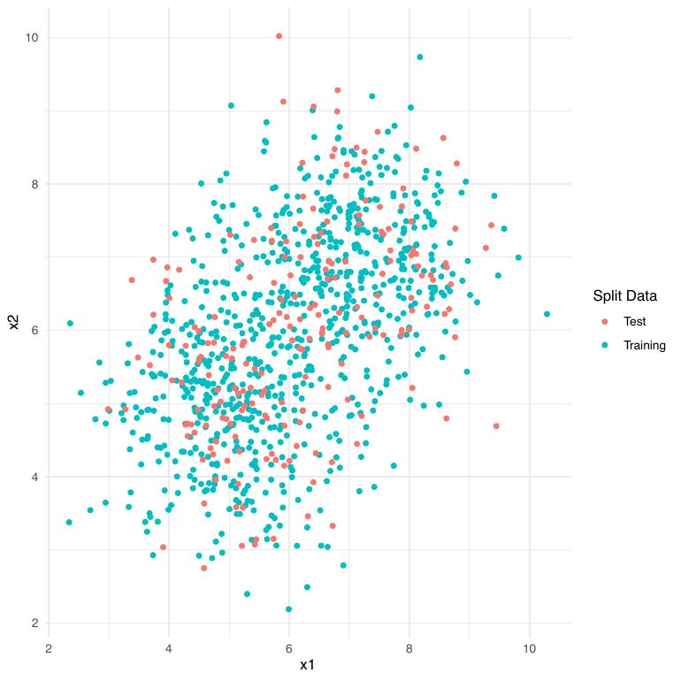
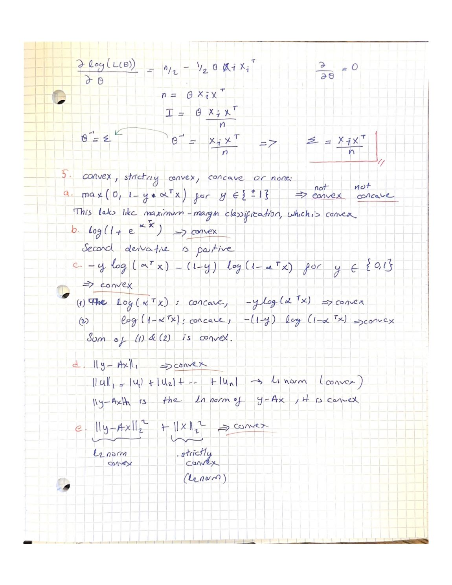

# 01 · K-Nearest Neighbors from scratch

Implementing k-NN for **both classification and regression** without any ML library, then
checking my code against the library implementations.

### What's here
- [`knn.Rmd`](knn.Rmd) — R Markdown source
- [`theory/`](theory/) — hand-written foundations (PDF + page below)

### What I built
- **`knn_classification_scratch()`** — for each test point, compute Euclidean distances to all
  training points, take the *k* nearest, and vote by majority class.
- **`knn_regression_scratch()`** — same neighborhood, but average the neighbors' targets.
- Benchmarked against `class::knn` (classification) and `kknn::kknn` (regression) on simulated
  two-class data.

### Result
The from-scratch predictions converge to the library implementations as *k* grows — the
neighborhoods (and therefore the decisions) become the same. The point of doing it by hand was
to see that "k-NN" is nothing more than *distance → sort → vote/average*.

### Figures

| Simulated two-class data | Train / test split |
|:---:|:---:|
|  |  |

### The math behind it (hand-written)

The prerequisite foundations for the course — here, checking the **convexity** of the common loss
functions (hinge, logistic) that everything later optimizes:

Full set (convexity, maximum likelihood, eigen-decomposition): **[knn-theory.pdf](theory/knn-theory.pdf)**.

**Concepts:** distance metrics · the bias–variance role of *k* · classification vs. regression
with the same neighborhood rule.
