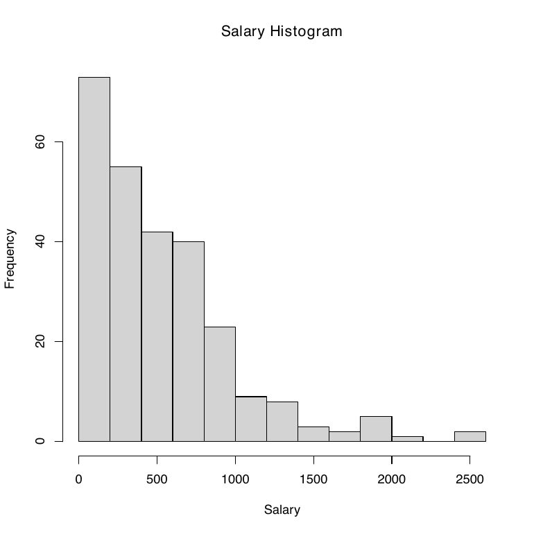
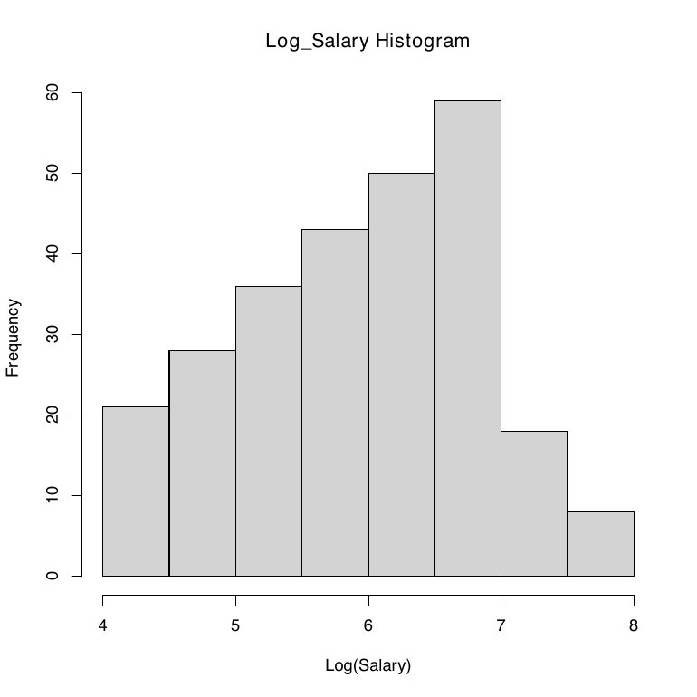
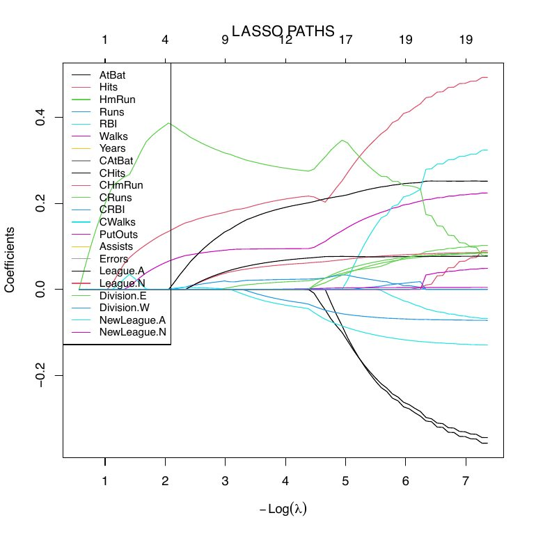
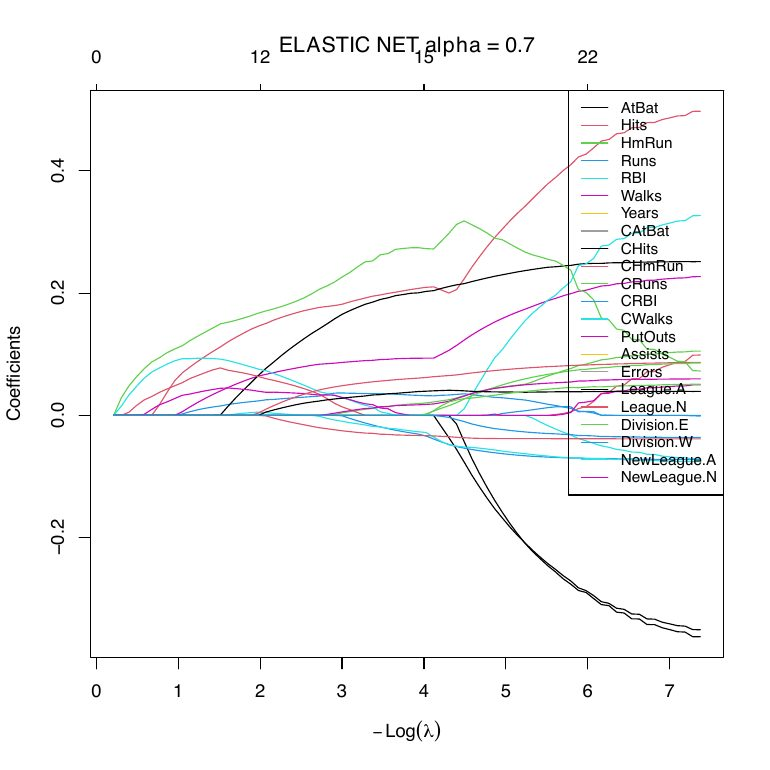
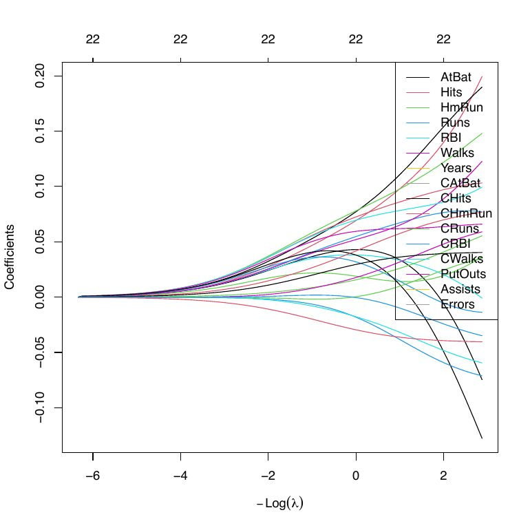
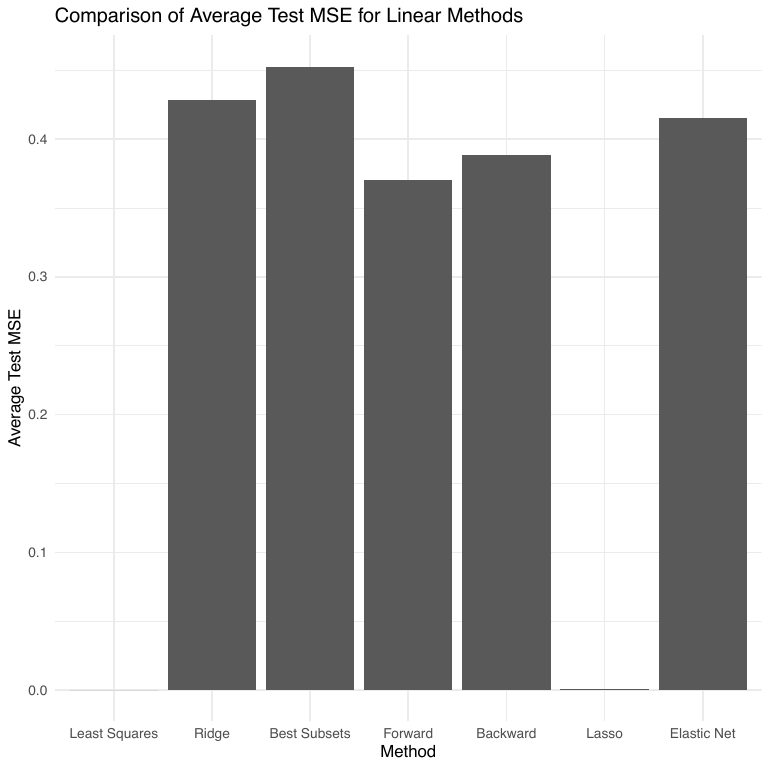

# Regularization & Feature Selection

A walkthrough of linear feature-selection and regularization on the **`Hitters`** baseball
dataset: *which features matter most*, and *which linear method predicts best*. Every method is
coded from the ground up, with the coefficient behavior visualized along the way.

> **Expanded standalone version:** also published as a self-contained, tutorial-style
> repository — **[ML_Feature_Selection_R](https://github.com/NeuroTune/ML_Feature_Selection_R)**.
>
> Full source: [`regularization.Rmd`](regularization.Rmd)

## Setup

```r
library(ISLR2)     # Hitters dataset
library(glmnet)    # Lasso / Elastic Net / Ridge
library(leaps)     # best subsets
library(MASS)      # stepwise (stepAIC)
library(tidyverse); library(caret)
data("Hitters")
```

## Data preparation

Drop rows with missing salaries, **log-transform** the (right-skewed) salary, one-hot encode the
categorical columns, then split 60/20/20 and center + standardize:

```r
cleaned_hitters <- na.omit(Hitters)
cleaned_hitters$Log_Salary <- log(cleaned_hitters$Salary)

# one-hot encode League / Division / NewLeague
dumm_data    <- dummyVars(~., data = categorical_data)
encoded_data <- data.frame(predict(dumm_data, newdata = categorical_data))

# 60% train / 20% validation / 20% test, then center + scale
train_indices <- sample(1:N, 0.6 * N)
X_standardized <- scale(as.matrix(organized_data[, -1]), center = TRUE, scale = TRUE)
y_centered     <- as.numeric(DATA_SCALED[, 1])
```

## Exploratory data analysis

Salary is heavily right-skewed, so we model `log(Salary)` instead — the log version is far closer
to symmetric:

```r
hist(cleaned_hitters$Salary,     main = "Salary Histogram",     xlab = "Salary")
hist(cleaned_hitters$Log_Salary, main = "Log_Salary Histogram", xlab = "Log(Salary)")
```

| Salary | log(Salary) |
|:---:|:---:|
|  |  |

## Which features are most important?

The same question, asked five ways.

**1 · Statistical significance in linear regression** — keep predictors with *p* < 0.05:

```r
fitc <- lm(y_centered ~ X_standardized)
summary_lm <- summary(fitc)   # retain coefficients with p-value < 0.05
```

**2 · Best subsets** — exhaustive search, scored by Adjusted R², Cp, and BIC:

```r
fitbsub <- regsubsets(x = X_standardized, y = y_centered)
res.sum <- summary(fitbsub)
ADJ <- which.max(res.sum$adjr2); CP <- which.min(res.sum$cp); BIC <- which.min(res.sum$bic)
```

**3 · Stepwise** — greedy forward (via BIC) and backward selection:

```r
fitf <- stepAIC(fit0, scope = formula, direction = "forward",  k = log(nrow(DATA_SCALED)))
fitb <- stepAIC(fit0,                  direction = "backward", k = log(nrow(DATA_SCALED)))
```

**4 · Lasso** — L1 shrinkage drives some coefficients exactly to zero:

```r
fitl_02 <- glmnet(x = X_standardized, y = y_centered, lambda = 0.2, alpha = 1, intercept = FALSE)
```

**5 · Elastic Net** — a blend of L1 and L2 (`alpha = 0.5`):

```r
fitl1 <- glmnet(x = X_standardized, y = y_centered, lambda = 0.1, alpha = 0.5, intercept = FALSE)
```

**Takeaway:** the five criteria largely agree on a core set — **Hits, Walks, and Years** are the
most frequently selected — while disagreeing at the margin, exactly where correlated features and
the L1/L2 penalty geometry pull differently.

## Regularization paths

Refitting across a grid of `λ` shows *how* each penalty shrinks coefficients toward zero.

**Lasso** — coefficients hit zero one by one (sparsity):

```r
fitl <- glmnet(x = X_standardized, y = y_centered, alpha = 1)
plot(fitl); title("LASSO PATHS")
```


**Elastic Net** — at two alphas, a softer version of the same:

```r
for (alpha in c(0.3, 0.7))
  plot(glmnet(X_standardized, y_centered, alpha = alpha), xvar = "lambda")
```


**Ridge** — L2 shrinks everything smoothly, nothing reaches exactly zero:

```r
fit_glm <- glmnet(X_standardized, y_centered, alpha = 0, standardize = FALSE, intercept = FALSE)
plot(fit_glm, xvar = "lambda")
```


## Which linear method predicts best?

Averaging test-set MSE over 10 random splits for each method:

```r
for (ii in 1:num_iterations) {
  # re-split, re-scale, fit each method, accumulate test MSE
}
```


Ridge and Elastic Net edge out plain least squares — the bias they add is repaid by lower
variance on held-out data.

## Empirical demonstrations of regression theory

Small experiments that confirm the algebra with code:

- fitting with an intercept ≡ centering `y` and the columns of `X` ≡ adding a column of ones;
- least squares has **zero training error when p > n**;
- the **MSE-existence theorem** — there exists a `λ` for which ridge beats OLS on test MSE.

## The math behind it (hand-written)

Deriving the **Lasso / Elastic-Net solver** — the proximal / ADMM updates whose soft-thresholding
step is exactly what drives coefficients to zero:


Full derivations: **[regularization-theory.pdf](theory/regularization-theory.pdf)**.

---

**Concepts:** L1 vs. L2 geometry · subset selection vs. shrinkage · regularization paths ·
bias–variance · why regularization can strictly beat OLS.
