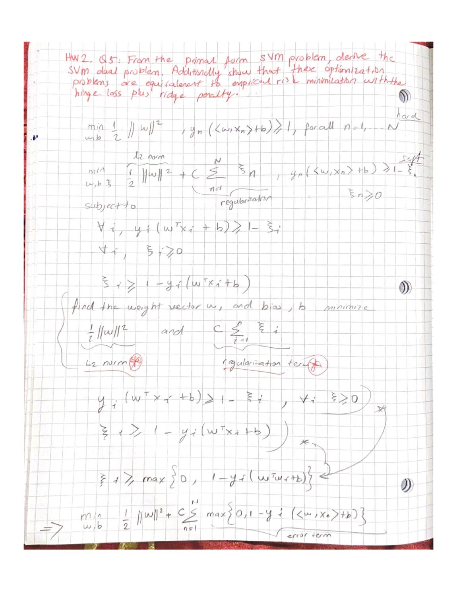
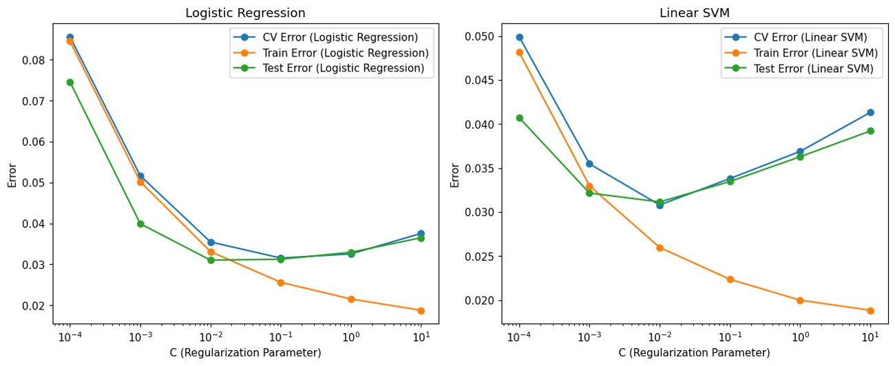

# 03 · Cross-validation & classification

Cross-validation written from scratch to tune models, then a tour of linear and kernel
classifiers — on binary MNIST (digits **3 vs 8**) and the full 10-class problem.

### What's here
- [`cross-validation.ipynb`](cross-validation.ipynb) — Jupyter notebook (executed, plots render inline)
- [`theory/`](theory/) — hand-written derivations (PDF + page below)

### What I built
- **k-fold cross-validation from scratch** — my own fold splitting and error accumulation, used
  to tune the regularization strength of sparse **logistic regression** and a **linear SVM**,
  plotting CV error against training and test error.
- A comparison of classifiers on the multi-class problem: **multinomial logistic regression,
  naïve Bayes, LDA, linear SVM (one-vs-all), and kernel SVM (RBF & polynomial)** — with
  confusion matrices and test accuracies.

### The math behind it (hand-written)

Deriving the SVM **dual** from the primal, and showing the max-margin problem is equivalent to
regularized empirical-risk minimization — **hinge loss + ridge penalty**:

Full derivations: **[cross-validation-theory.pdf](theory/cross-validation-theory.pdf)**.

### Result
The from-scratch CV curve tracks the library's and picks the same regularization sweet spot;
across classifiers, the linear/kernel SVMs and multinomial logistic lead on the 3-vs-8 and
10-class tasks, matching what the bias–variance and margin arguments predict.

### Figures

From-scratch k-fold cross-validation — CV, training, and test error vs. the regularization
strength `C`. Training error keeps falling while CV/test error bottoms out and turns back up:
the overfitting signature the CV is there to catch.

*(Regenerated by re-running the notebook; multinomial-logistic ≈ 0.926, LDA ≈ 0.873, naïve Bayes ≈ 0.837 on the 10-class task.)*

**Concepts:** cross-validation mechanics · regularization tuning · logistic regression, SVM
margins & kernels, LDA, naïve Bayes · GPR/kernel-ridge duality · Newton ≡ IRLS.
