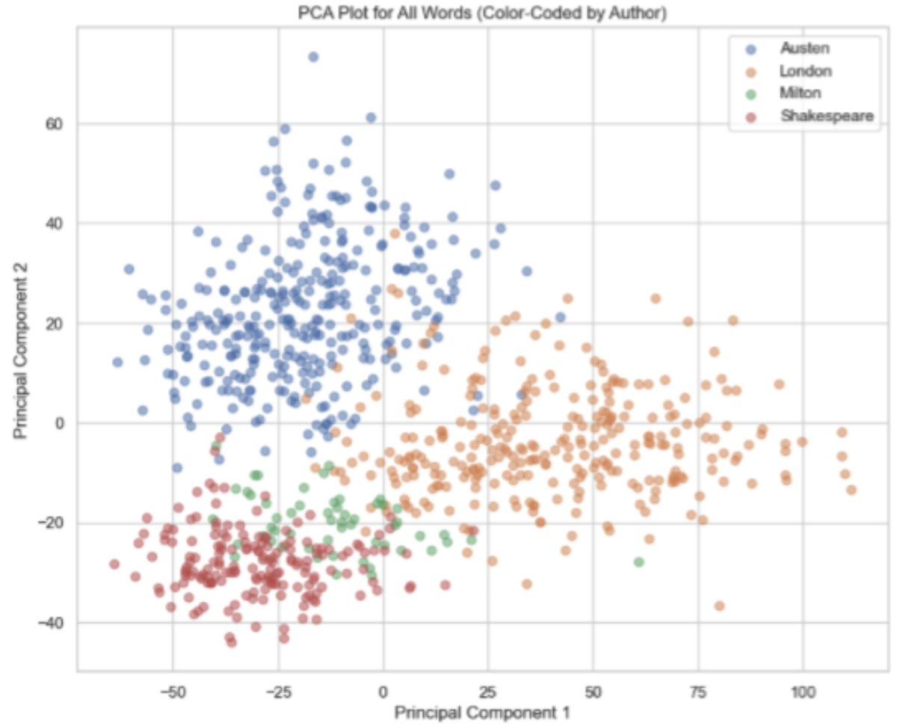
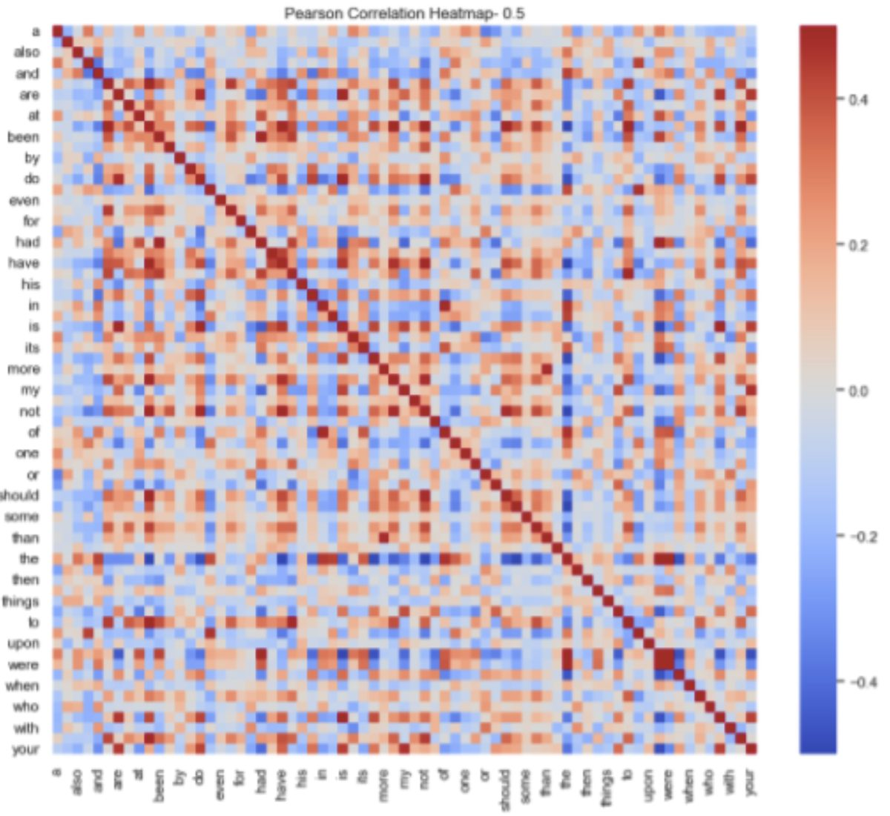
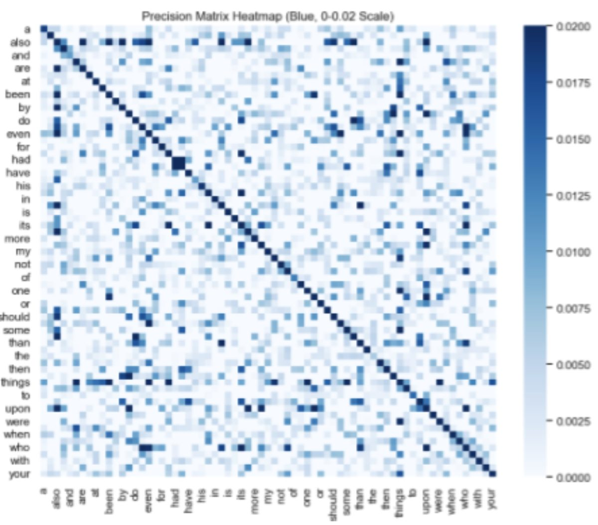
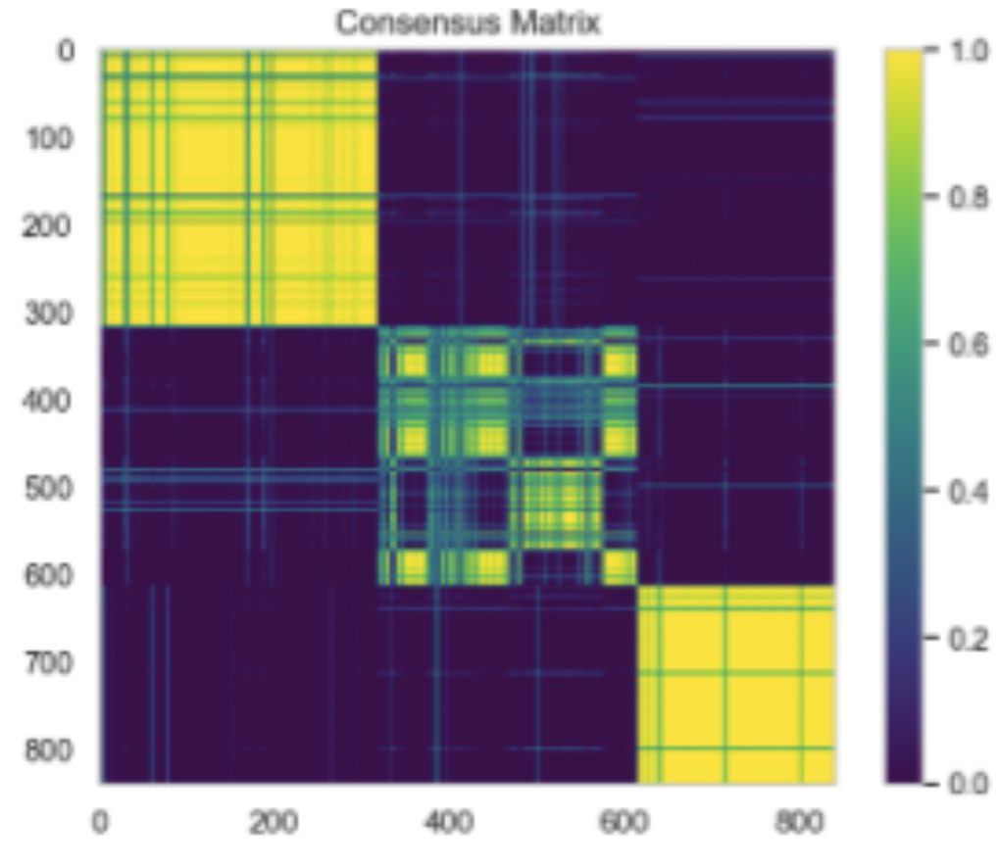

# 04 · Clustering, PCA & graphical models

Unsupervised learning on an **authorship** dataset — word-frequency profiles for texts by
Austen, London, Milton, and Shakespeare — plus the theory tying dimension reduction and
graphical models together.

### What's here
- [`clustering.ipynb`](clustering.ipynb) — Jupyter notebook (executed, plots render inline)
- [`theory/`](theory/) — hand-written derivations (PDF + page below)

### What I built
- **Dimension reduction** — PCA and t-SNE to project the word-frequency space and see the
  authors separate.
- **Clustering** — k-means and hierarchical clustering (linkage + `fcluster`), evaluated with
  the adjusted Rand index against the true author labels, plus a **consensus matrix** to assess
  cluster stability across runs.
- **Graphical models** — a graphical Lasso fit to recover the sparse conditional-dependence
  structure among words.

### The math behind it (hand-written)

Proving classical (metric) **MDS ≡ PCA** via the double-centered Gram matrix (the full notes also
show why centroid linkage can *invert* a dendrogram):

Full derivations: **[clustering-theory.pdf](theory/clustering-theory.pdf)**.

### Result
PCA/t-SNE separate the four authors cleanly, and the recovered clusters align with the true
labels (high adjusted Rand index) with a stable consensus matrix; the graphical Lasso surfaces
interpretable word co-dependencies. The derivations explain *why* these methods see the same
structure — MDS and PCA are the same map, and precision-matrix sparsity is conditional
independence.

### Figures

The four authors separate in the first two principal components:

**Correlation vs. conditional dependence.** Side by side: the raw **Pearson correlation** (which
words *co-occur* — marginal association) and the graphical-Lasso **precision matrix** (which words
depend on each other *once every other word is accounted for*). Many strong correlations vanish in
the precision matrix — they were explained away by other words. A zero there means conditional
independence, exactly as in the derivation.

| Pearson correlation (marginal) | Precision matrix (conditional) |
|:---:|:---:|
|  |  |

Clustering stability — the consensus matrix, with clear block structure for the recovered clusters:

**Concepts:** PCA / MDS duality · t-SNE · k-means & hierarchical/consensus clustering ·
adjusted Rand index · Gaussian graphical models · precision matrices & conditional independence.
