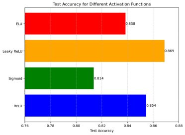
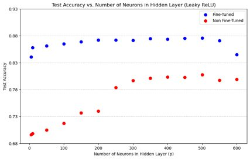
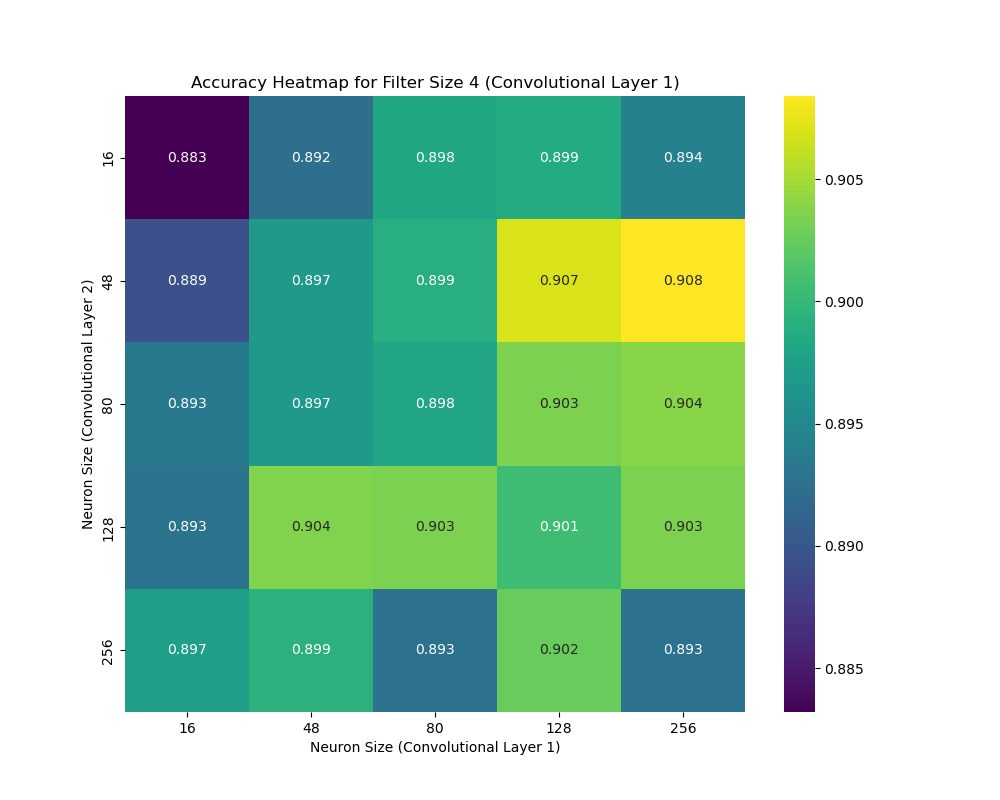
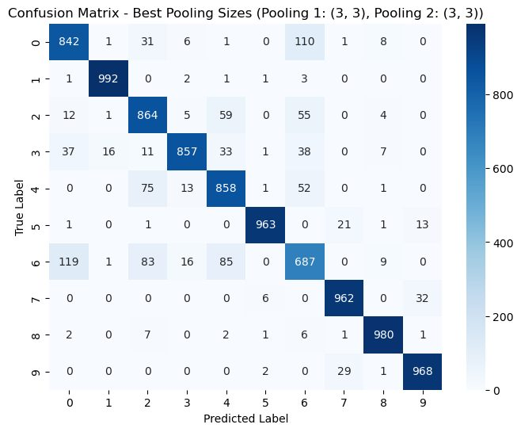
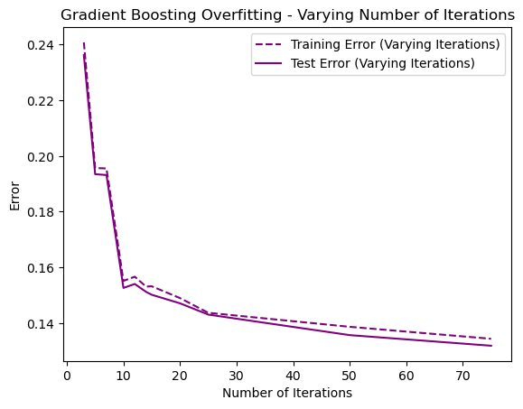
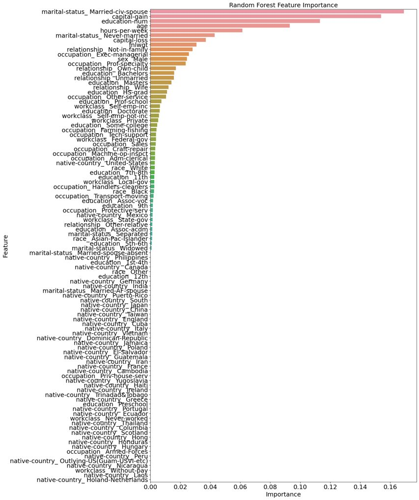
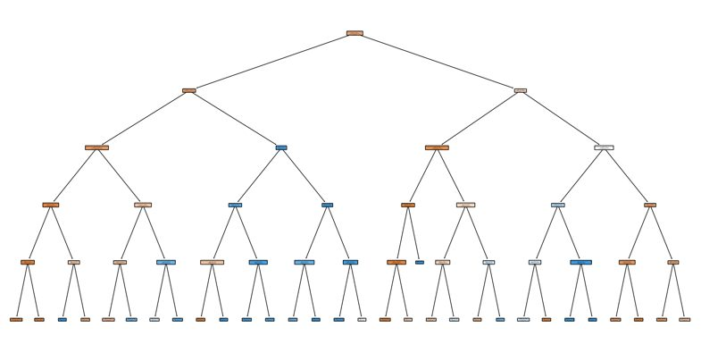

# 05 · Neural nets & tree ensembles

Deep learning and ensemble methods, end to end — feed-forward and convolutional nets on
**Fashion-MNIST**, and tree ensembles on the **Adult** income dataset.

### What's here
- [`neural-nets-trees.ipynb`](neural-nets-trees.ipynb) — Jupyter notebook (executed, plots render inline)

### What I built

**Neural networks (Fashion-MNIST, TensorFlow/Keras):**
- **Activation-function study** — ReLU vs. Sigmoid vs. Leaky ReLU vs. ELU, each with its own
  learning-rate tuning, compared on test accuracy and runtime.
- **Network-size study** — accuracy vs. number of hidden units, with and without learning-rate
  fine-tuning.
- **MLP** — a deeper multi-layer perceptron.
- **CNN** — convolutional architecture, with filter-size / neuron-count sweeps (and filter
  visualizations).
- **Max-pooling** — effect of pooling size on accuracy and runtime.

**Tree ensembles (Adult dataset, scikit-learn):**
- Decision trees, bagging, random forests, AdaBoost, gradient boosting.
- **Out-of-bag error** curves for bagging/random forests; deliberate overfitting then proper
  hyperparameter tuning of each method, compared on accuracy.

### Result
Among activations, the ReLU-family functions (ReLU/Leaky ReLU/ELU) beat Sigmoid on both accuracy
and training time; the CNN with max-pooling outperforms the plain MLP. Among trees, the boosted
and bagged ensembles beat a single tuned tree, with out-of-bag error tracking test error closely.

### Results (from the original execution)

*Figures and numbers below are from the original run — TensorFlow legacy-Keras on Apple Silicon.*

**Neural networks (Fashion-MNIST).** Activation comparison and the effect of hidden-layer size:

| Activation-function comparison | Network-size study |
|:---:|:---:|
|  |  |

Architecture progression, and the best CNN:

| CNN accuracy heatmap | CNN confusion matrix |
|:---:|:---:|
|  |  |

| Architecture | Test accuracy |
|---|:---:|
| Feed-forward, 1 hidden layer | 0.854 |
| Feed-forward, 2 hidden layers | 0.867 |
| CNN (2 conv layers) | **0.908** |
| CNN + max-pooling | 0.906 |

(Activations, best learning rate each: ReLU 0.854 · Sigmoid 0.814 · **Leaky ReLU 0.869** · ELU 0.838.)

**Tree ensembles (Adult dataset).** Overfitting behavior, feature importance, and tuned accuracy:

| Gradient-boosting overfitting | Random-forest feature importance | Decision-tree structure |
|:---:|:---:|:---:|
|  |  |  |

| Method (tuned) | Test accuracy |
|---|:---:|
| Decision Tree | 0.861 |
| Bagging | 0.858 |
| AdaBoost | 0.815 |
| **Gradient Boosting** | **0.875** |
| Random Forest | 0.864 |

Across every model the strongest single predictor is `marital-status = Married-civ-spouse`,
followed by `capital-gain`, `education-num`, and `age`.

> **Running note:** this notebook targets the **Keras 2** API (`tf.keras.optimizers.legacy.*`,
> `Flatten(input_shape=…)`), which was removed in Keras 3. Run it with `tensorflow==2.15`
> (Python ≤ 3.11), or `tensorflow==2.19` + `tf-keras` and `TF_USE_LEGACY_KERAS=1`.

**Concepts:** activation functions · learning-rate tuning · MLPs, CNNs, pooling · backprop ·
bagging, boosting, random forests · out-of-bag error · overfitting vs. tuning.
