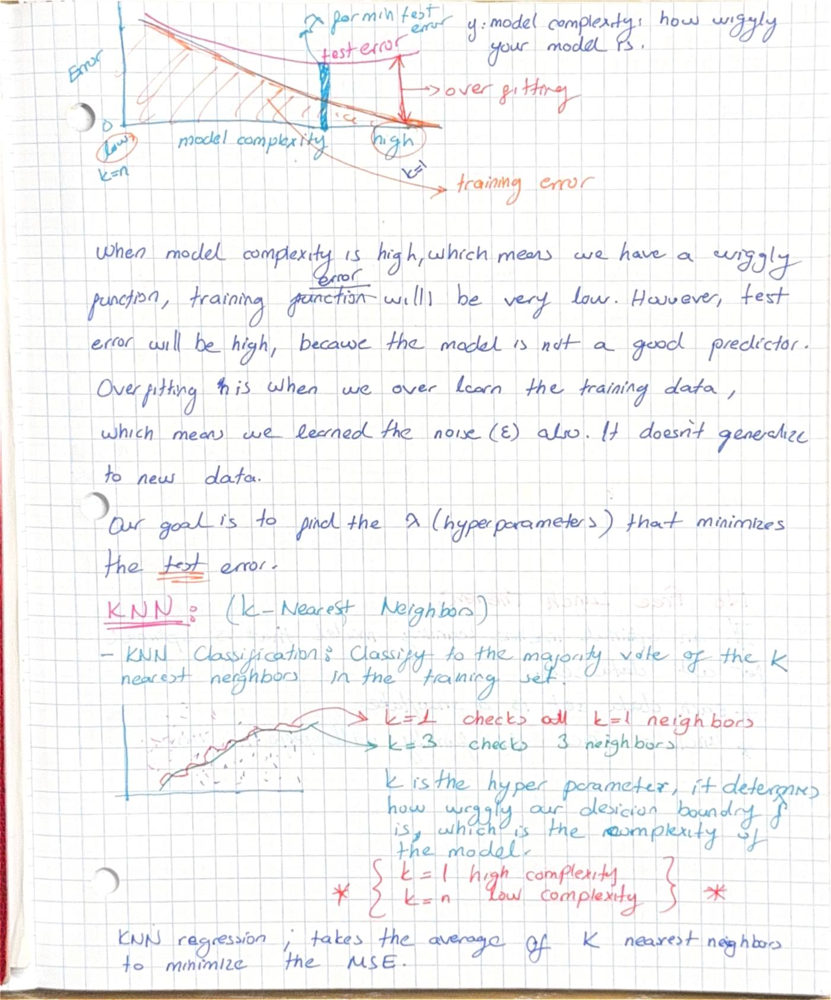
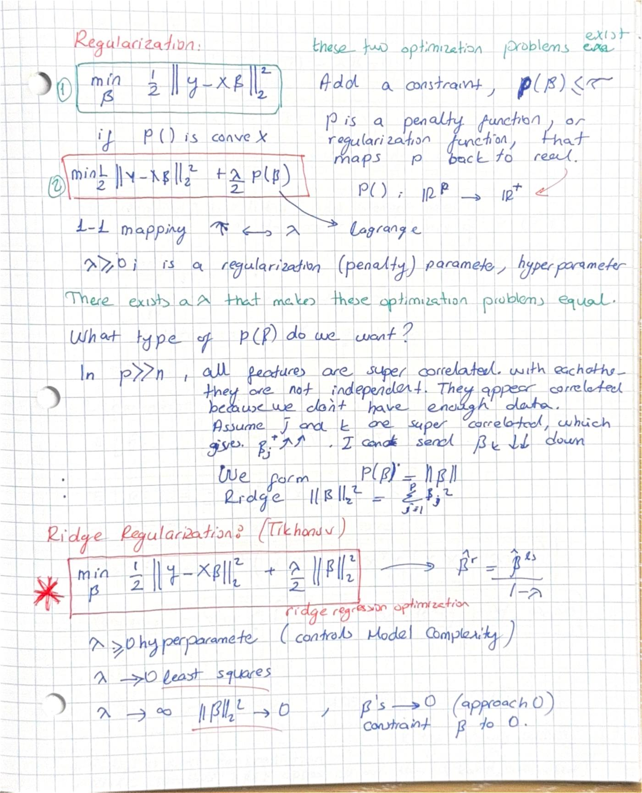
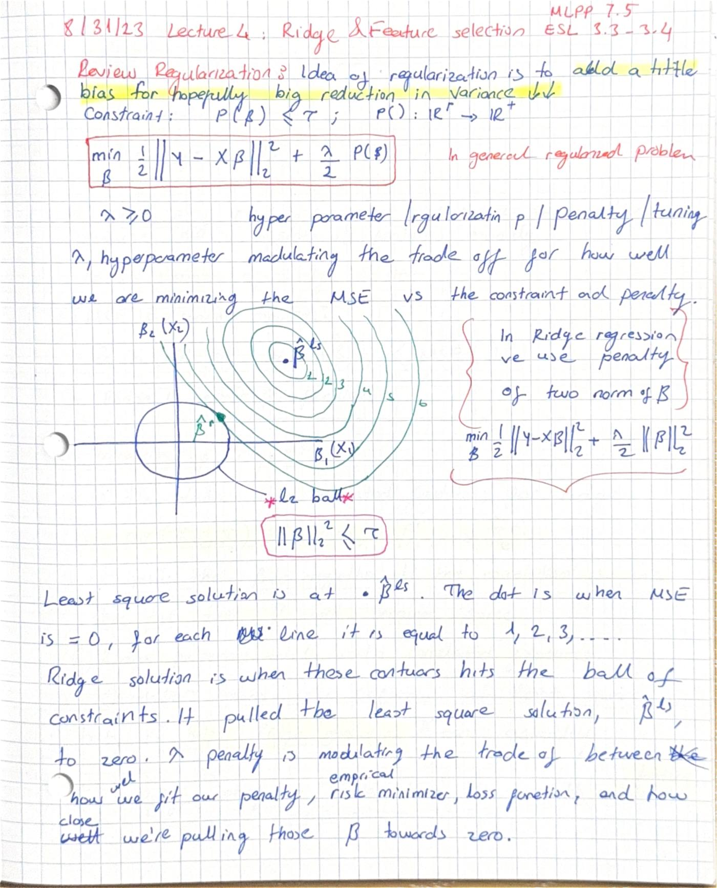
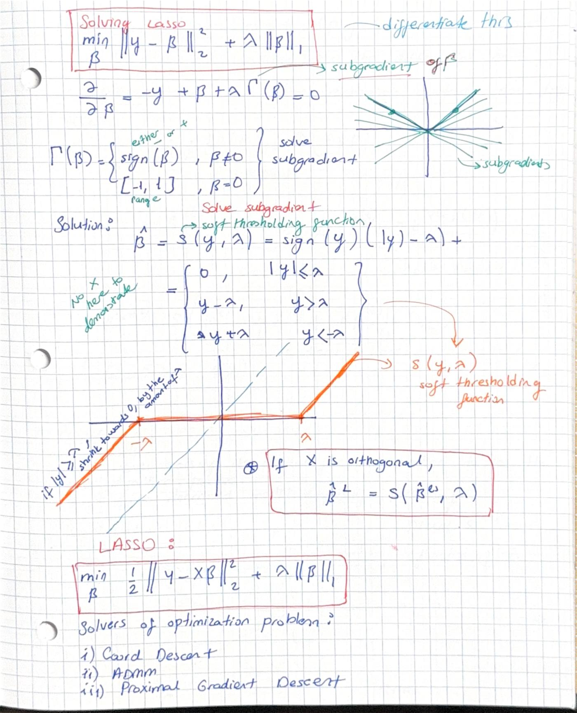
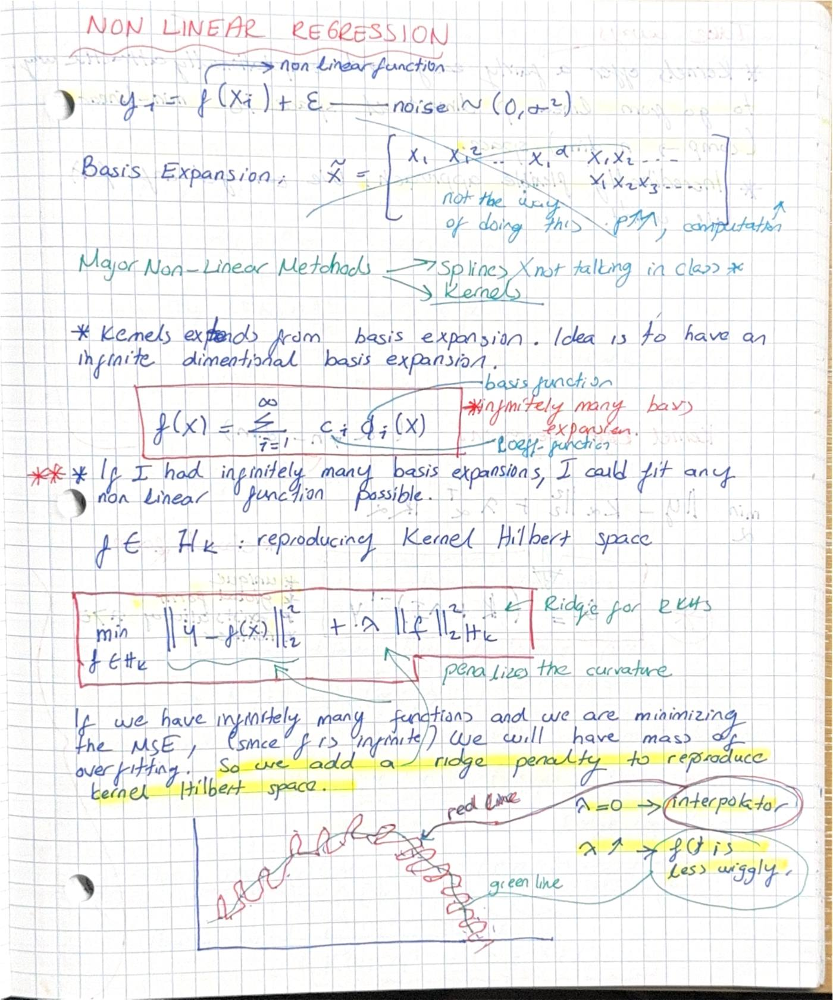
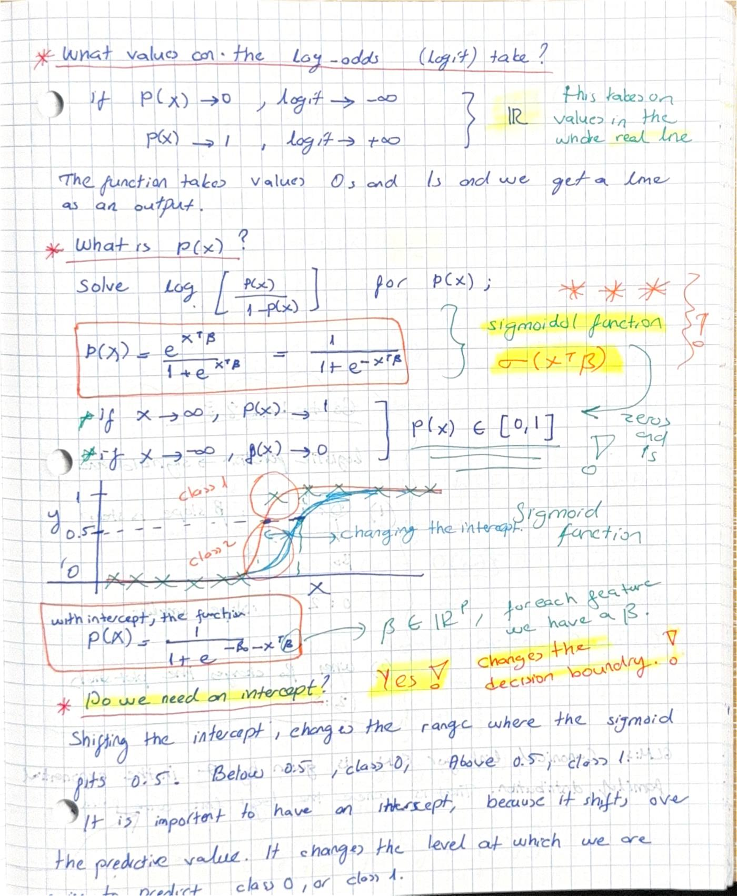
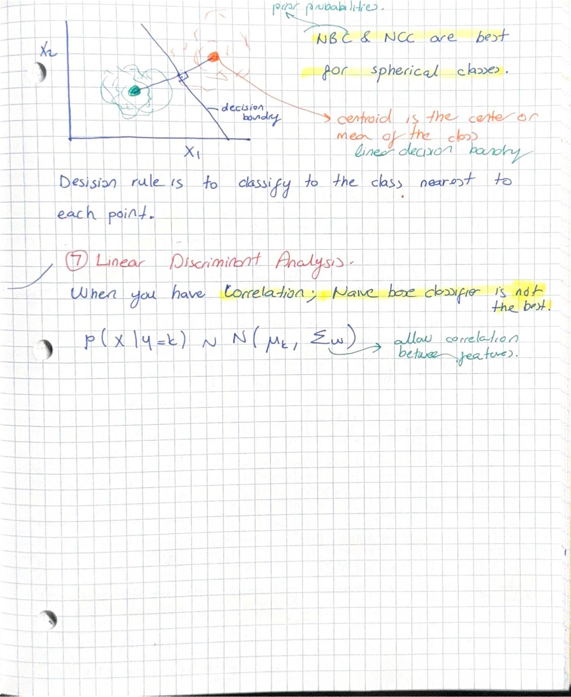
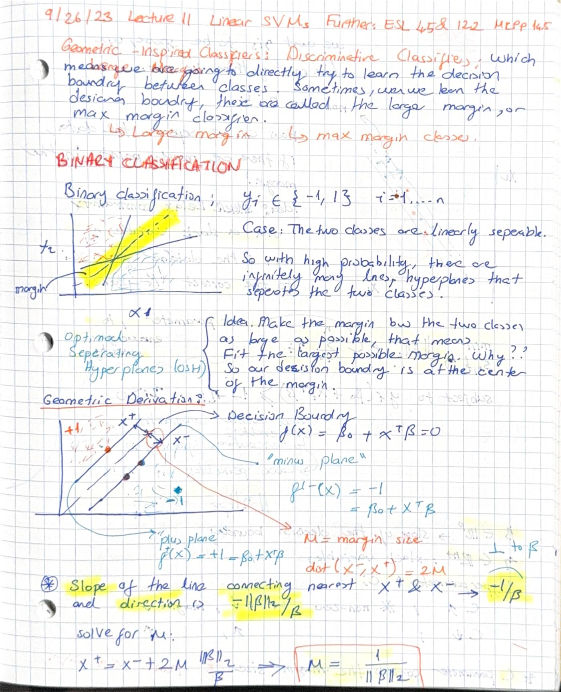
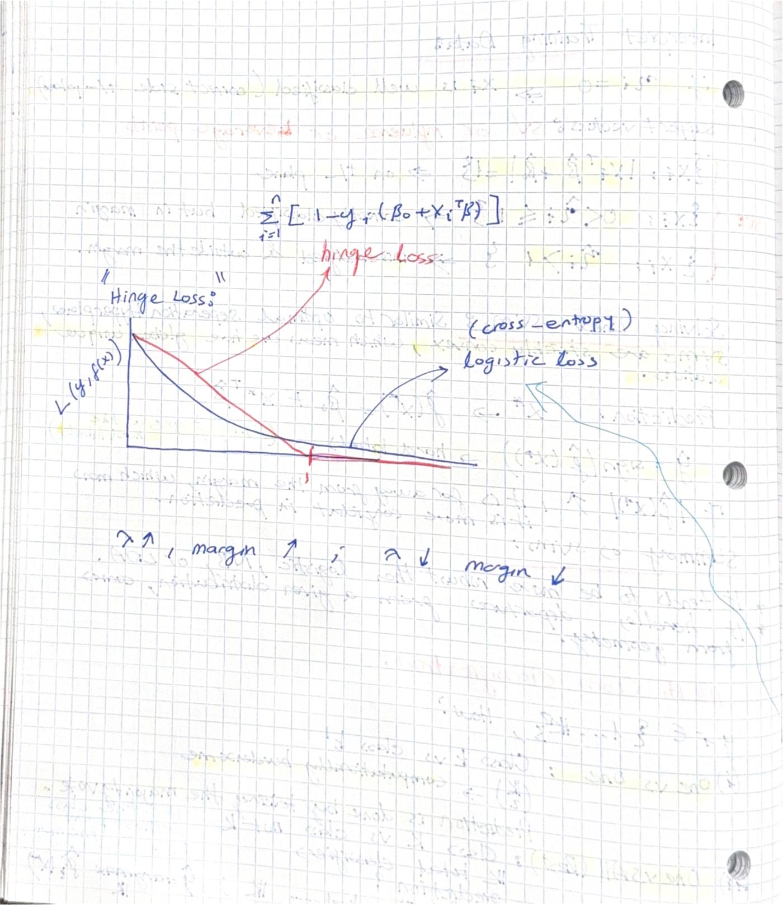

# Course notes

My hand-written notes for the course — the running record of working through the material.
Where the topic folders show *applied* implementations, these are the *conceptual* backbone:
derivations, geometry, and the intuition behind each method, color-coded as I worked.

**Full notes (57 pages):** [ML-all-course-notes.pdf](ML-all-course-notes.pdf)

> The high-resolution originals (~138 MB) are kept locally and not committed; this repo ships a
> compressed PDF plus the featured pages below.

## Featured pages

**Model complexity, over-fitting & KNN** — bias–variance and the role of *k*.

**Ridge regularization theorem (Tikhonov)** — deriving the shrinkage `β̂ = β̂ˡˢ / (1 + λ)`.

**Regularization as constrained optimization** — the ridge contours meeting the L2 ball.

**Solving the Lasso** — subgradients and the soft-thresholding operator.

**Non-linear regression** — basis expansion, kernels, and reproducing-kernel Hilbert spaces.

**Logistic regression** — log-odds, the sigmoid, and why the intercept matters.

**LDA & nearest-centroid classifiers** — decision boundaries when features are correlated.

**Linear SVMs** — the max-margin classifier, derived geometrically.

**Loss functions** — hinge vs. logistic (cross-entropy), and what the margin buys you.

## What's in the full PDF

| Section | Topics |
|---------|--------|
| **Ch 1–4** (pp. 1–21) | Model complexity & over-fitting · KNN · bias–variance · least squares · geometric interpretation of regression · ridge & Lasso · the ridge regularization theorem · feature selection |
| **Ch 5–8** (pp. 22–44) | Optimization & solving the Lasso (subgradients, soft-thresholding, proximal/coordinate/gradient descent) · regularization paths · non-linear regression, basis expansion, kernels & RKHS · cross-validation · GLMs & logistic regression |
| **Ch 10–12** (pp. 45–57) | Bayes classifiers, LDA & nearest-centroid · linear & kernel SVMs and the max-margin derivation · loss functions (hinge, logistic, exponential) · boosting & ensembles |

*(Page numbers refer to the combined [ML-all-course-notes.pdf](ML-all-course-notes.pdf).)*
